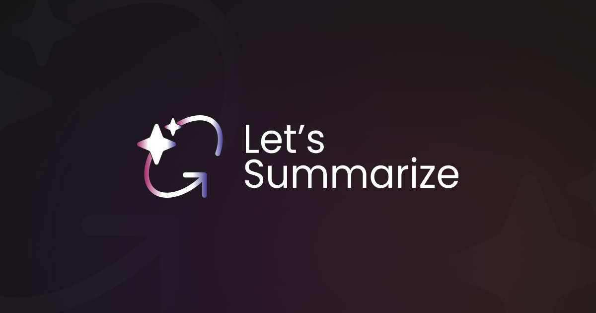

<div align="center">

<h1>Let's Summarize Web Application</h1>

<p>
  Let's Summarize Web Application is a tool that allows users to summarize videos, documents, and raw texts.
  Built on top of the <strong><a href="https://github.com/letssummarize/api">Let's Summarize API</a></strong>.
</p>



</div>

---

## Prerequisites

Before running the application, ensure you have the following installed:

- **Node.js** (v20 or higher) → [Download Here](https://nodejs.org/)
- **pnpm** (v10 or higher) → [Install Guide](https://pnpm.io/installation)

---

## Getting Started

Follow these steps to set up and run the project:

1️. **Install dependencies**  

```bash
pnpm i
```

2️. **Copy the environment file**  

```bash
cp .env.example .env
```

3️. **Configure environment variables**  

Edit the `.env` file and update the required values:

| Variable Name | Description | Required | Default Value |
|--------------|-------------|----------|---------------|
| `NEXT_PUBLIC_API_URL` | The API URL for Let's Summarize | ✅ Yes | `http://localhost:3000` |
| `USE_API_DEFAULT_MODELS_API_KEYS` | Use default API model keys | ❌ No | `true` |
| `NEXT_PUBLIC_OPENAI_API_KEY` | OpenAI API key for summarization. _(No need to provide this if `USE_API_DEFAULT_MODELS_API_KEYS` is true)_ | ✅ Yes | `your_openai_api_key_here` |
| `NEXT_PUBLIC_DEEPSEEK_API_KEY` | DeepSeek API key (if used) | ⚠️ Required only if `USE_API_DEFAULT_MODELS_API_KEYS` is false and `NEXT_PUBLIC_ENABLE_LOGGING` is not provided | `your_deepseek_api_key_here` |
| `NEXT_PUBLIC_ENABLE_LOGGING` | Enable application logging | ⚠️ Required only if `USE_API_DEFAULT_MODELS_API_KEYS` is false and `NEXT_PUBLIC_DEEPSEEK_API_KEY` is not provided | (empty) |
| `NEXT_PUBLIC_AUDIO_URL` | Audio processing URL if the API you used uses local storage | ✅ Yes | `http://localhost:3000` |

> ⚠️ **Important:**  
> The `NEXT_PUBLIC_API_URL` is **required**. Without a valid API URL, the application's functionalities **will not work**.  
> To create your own API, install it from the [GitHub repository](https://github.com/letssummarize/api) and follow the [documentation](https://github.com/letssummarize/api/tree/main/docs/getting-started.md).

4️. **Run the development server**  

```bash
pnpm dev
```

5️. **Open in Browser**  
Visit **[http://localhost:3000](http://localhost:3000)** in your web browser to see the app in action.

---

## Powered by Let's Summarize API

This web application is built on top of the **Let's Summarize API**, which provides the summarization logic for videos, PDFs, and text.

**API Repository**: [Let's Summarize API](https://github.com/letssummarize/api)  
**API Documentation**: [View Docs](https://github.com/letssummarize/api/tree/main/docs)