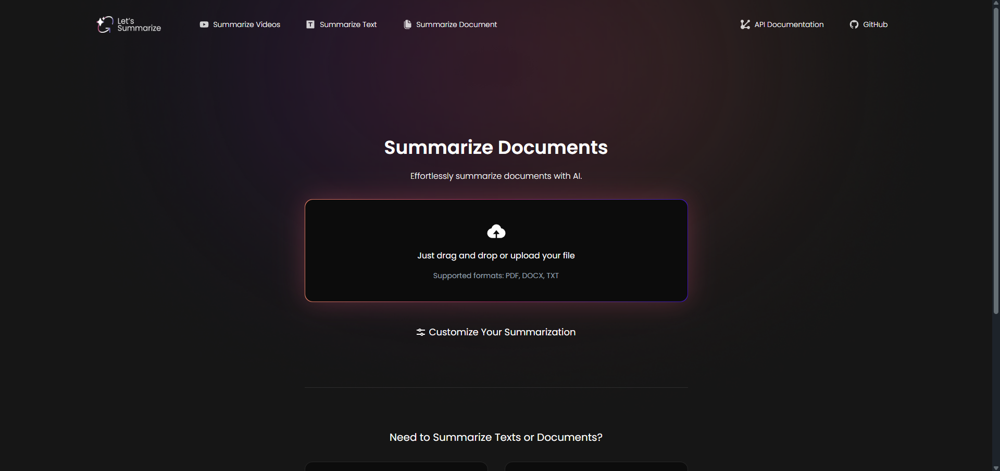

<div align="center">

<h1>Let's Summarize Web Application</h1>

<p>
  Let's Summarize Web Application is a tool that allows users to summarize videos, documents, and raw texts.
  Built on top of the <strong><a href="https://github.com/letssummarize/api">Let's Summarize API</a></strong>.
</p>


</div>

- [Problems and How "Let’s Summarize" Solves Them](#problems-and-how-lets-summarize-solves-them)
  - [Summarizing a YouTube Video Without a Transcript](#summarizing-a-youtube-video-without-a-transcript)
  - [Screenshots](#screenshots)
- [Development](#development)
  - [Prerequisites](#prerequisites)
  - [Getting Started](#getting-started)
- [Powered by Let's Summarize API](#powered-by-lets-summarize-api)

---

## Problems and How "Let’s Summarize" Solves Them

| **Problem**                                                                                                                                  | **Solution**                                                                                                                   |
| -------------------------------------------------------------------------------------------------------------------------------------------- | ------------------------------------------------------------------------------------------------------------------------------ |
| ❌ Content often includes too many unimportant details and repetitions, making it hard to extract useful summaries.                           | ✅ The tool summarizes most important type of content (YouTube, documents, text) with options to customize the output.          |
| ❌ Content may be very long and cover multiple topics, but users might only need one specific part.                                           | ✅ Users can give specific instructions on what part to summarize or how they want the summary written.                         |
| ❌ Existing tools like ChatGPT, and Black Box are not designed specifically for summarization and can be hard to use for non-technical users. | ✅ A dedicated, easy-to-use web interface focused only on summarization was created.                                            |
| ❌ YouTube summarization tools don’t work well if the video lacks a transcript or uses inaccurate auto-generated transcripts.                 | ✅ The tool supports summarizing any YouTube video, with or without a transcript, using both fast and slow summarization modes. |
| ❌ Many tools don’t support summarizing Arabic content or translating English content into Arabic summaries.                                  | ✅ The tool supports summarization and summary output in both Arabic and English.                                               |
| ❌ No tools combine multiple AI models to improve summarization quality.                                                                      | ✅ The tool uses multiple AI models: GPT-4o and DeepSeek-V3.                                                                    |
| ❌ Summaries are not available as audio in either Arabic or English.                                                                          | ✅ The tool provides TTS (Text-to-Speech) for summaries in both Arabic and English.                                             |
| ❌ No open-source API available that solves all these problems for developers.                                                                | ✅ An [open-source API](https://github.com/letssummarize/api) was provided to allow developers to use summarization features in their own apps.                         |

### Summarizing a YouTube Video Without a Transcript

When it comes to summarizing YouTube videos that **do not have transcripts**, many tools fall short. One such example is **Blackbox.ai**, which can be used as a free AI tool for summarizing YouTube videos (as they says):

<p align="center">
  
</p>

As shown below, **Blackbox** is unable to summarize videos without available transcripts. On the other hand, **Let’s Summarize** offers a solution for these cases by providing a **slow speed mode**, allowing it to summarize videos regardless of transcript availability.

<div align="center">
  
  <br />
  <em>Blackbox.ai attempting to summarize a <a href="https://youtu.be/372DqUtJnrw?si=x64tDDgAsoZFXFs4" target="_blank">YouTube video</a>, but fails as the video has no transcript. While **Let's Summarize** does not fail.</em>
</div>

Let’s Summarize is better suited for handling low-accessibility videos and provides more flexibility in how summaries are generated.

---

### Screenshots

1. **Summarize YouTube Video page**


2. **Summarize Text page**


3. **Summarize Documents page**



4. **Customize Your Summarization Modal (Part 1)**


5. **Customize Your Summarization Modal (Part 2)**


1. **Summary Result Page**


---

## Development

### Prerequisites

Before running the application, ensure you have the following installed:

- **Node.js** (v20 or higher) → [Download Here](https://nodejs.org/)
- **pnpm** (v10 or higher) → [Install Guide](https://pnpm.io/installation)

---

### Getting Started

Follow these steps to set up and run the project:

1️. **Install dependencies**  

```bash
pnpm i
```

2️. **Copy the environment file**  

```bash
cp .env.example .env
```

3️. **Configure environment variables**  

Edit the `.env` file and update the required values:

| Variable Name                     | Description                                                                                                                                                      | Required                                                                                                         | Default Value           |
| --------------------------------- | ---------------------------------------------------------------------------------------------------------------------------------------------------------------- | ---------------------------------------------------------------------------------------------------------------- | ----------------------- |
| `NEXT_PUBLIC_API_URL`             | The API URL for Let's Summarize                                                                                                                                  | ✅ Yes                                                                                                            | `http://localhost:3000` |
| `USE_API_DEFAULT_MODELS_API_KEYS` | Use default API model keys (OpenAI and DeepSeek keys) this mean you will not need to add vaues for `NEXT_PUBLIC_OPENAI_API_KEY` & `NEXT_PUBLIC_DEEPSEEK_API_KEY` | ❌ No                                                                                                             | `true`                  |
| `NEXT_PUBLIC_OPENAI_API_KEY`      | OpenAI API key for summarization. _(No need to provide this if `USE_API_DEFAULT_MODELS_API_KEYS` is true)_                                                       | ⚠️ Required only if `USE_API_DEFAULT_MODELS_API_KEYS` is false and `NEXT_PUBLIC_DEEPSEEK_API_KEY` is not provided | (empty)                 | ❌ No |
| `NEXT_PUBLIC_DEEPSEEK_API_KEY`    | DeepSeek API key (if used)                                                                                                                                       | ⚠️ Required only if `USE_API_DEFAULT_MODELS_API_KEYS` is false and `NEXT_PUBLIC_OPENAI_API_KEY` is not provided   | (empty)                 |
| `NEXT_PUBLIC_ENABLE_LOGGING`      | Enable application logging                                                                                                                                       | ❌ No                                                                                                             | false                   |
| `NEXT_PUBLIC_AUDIO_URL`           | Audio processing URL if the API you used uses local storage no S3 for storage                                                                                    | ✅ Yes                                                                                                            | `http://localhost:3000` |
| `NEXT_PUBLIC_RESTRICT_USER`        | Optional flag to enforce restrictions for free users (limits models, disables TTS, and slow speed mode for video summarization). Used mainly in frontend UI logic.	     | ❌ No                                                                                                            | `true`                 |

> ⚠️ **Important:**  
> The `NEXT_PUBLIC_API_URL` is **required**. Without a valid API URL, the application's functionalities **will not work**.  
> To create your own API, install it from the [GitHub repository](https://github.com/letssummarize/api) and follow the [documentation](https://github.com/letssummarize/api/tree/main/docs/getting-started.md).

4️. **Run the development server**  

```bash
pnpm dev
```

5️. **Open in Browser**  
Visit **[http://localhost:3000](http://localhost:3000)** in your web browser to see the app in action.

---

## Powered by Let's Summarize API

This web application is built on top of the **Let's Summarize API**, which provides the summarization logic for videos, PDFs, and text.

**API Repository**: [Let's Summarize API](https://github.com/letssummarize/api)  
**API Documentation**: [View Docs](https://github.com/letssummarize/api/tree/main/docs)